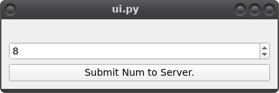
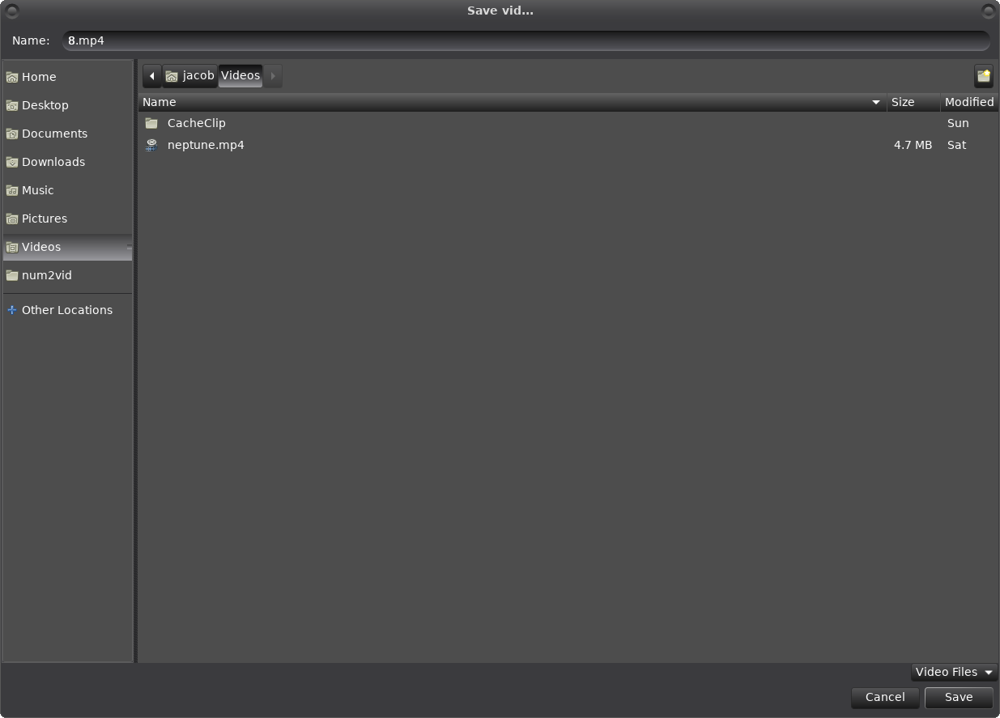
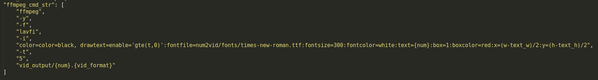
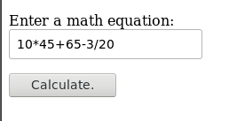
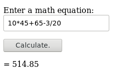
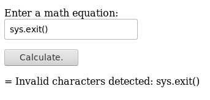

# Num2Vid (Linux/Windows)

A demonstration in Client - Server interactions. This project demosntrates sending an integer from a Client to a Flask server via http, and receiving back a 5-second video displaying the requested number. The video is generated entirely from ffmpeg on the server side and then sent back to the client.

The `num2vid` client API can also be imported directly as a python module.

## Getting Started

It is reccomended to run Num2Vid using a Python Virtual Environment to keep dependencies installed within the repo folder.

### Prerequisites

To get started clone or download/extract the `num2vid` repository and then open a cmd prompt or terminal and navigate to the repository root:

```
cd /path/to/num2vid/
```

We need `virtualenv` to continue so if needed install it with:

```
pip3 install virtualenv
```

Then, create a venv directory (at the `num2vid` repo root):

```
virtualenv venv
```

To activate the `virtualenv` on Linux:

```
source venv/bin/activate
```

To activate the `virtualenv` on Windows:

```
venv\Scripts\activate
```

Then, install dependencies:

```
pip3 install -r requirements.txt
```

### Installing

To launch the server and client it is reccomended to use the included `launcher.py` script. This will ensure the necessary environment variables are injected.

#### Server
First, activate the virtual environment the same way as above.

Linux:

```
source venv/bin/activate
```

Windows:

```
venv\Scripts\activate
```

Then launch the server:

Linux:

```
venv/bin/python launcher.py --server  # using the included python executeable
```

Windows:

```
venv\Scripts\python launcher.py --server  # using the included python executable
```

or if you already have a python3 alias set up on your system:

```
python3 launcher.py --server
```

#### Client

To launch the client open another terminal and navigate back to the repository directory and start a virtual environment the same way as above, then:

on Windows:

```
venv\Scripts\python launcher.py --client  # using the included python executable
```

on Linux:

```
venv/bin/python launcher.py --client  # using the included python executable
```

or if you already have python3 alias set up on your system:

```
python3 launcher.py --client
```

Now you should have at least 2 terminals open - one running the server and one running the client - along with the `PySide2` UI shown below.

## Using the client UI



To open the client UI at any time just repeat the above commands.

The spinbox input behaves also as our validation by only allowing integers between 1 and 10. You can enter in the number directly, use the mousee-wheel, or arrow keys as input.

Choose a number then press the `Submit Num to Server.` button to submit to server.

Upon receiving a response back from the server a file-save dialog will open for you to choose where to save your video locally.



The `ffmpeg` settings for creation of the video are entirely exposed in `num2vid/config/num2vid_config.json`, and can be manually edited at any time - give it a try!



## Using the client API as a python module

The client API can be run in any 3rd party DCC(supporting python3) or from the terminal by importing `Num2VidClient` from `num2vid` directly.

The `launcher.py` script can also be used to start an interactive python shell by using the `--python` argument.

Example using terminal:

```
source venv/bin/activate
python3 launcher.py --python
```

A python shell will start, with the `num2vid` module ready to be imported.:

```
>>> from num2vid import Num2VidClient
>>> from os import environ
```

Notice we also imported the `environ` method from the `os` module, this is to access the environmnet variable which was injected earlier by the `launcher.py` script.

To instantiate a new `Num2VidClient` instance, you just need to pass in the location of `num2vid/config/num2vid_config.json` or use our environmnet variable:

```
>>> c = Num2VidClient(environ["NUM2VID_CONFIG"])
>>> help(c)
```

Now, let's submit a num to the server. The `submit_num` method can either return a `requests.Response` object from the server, or download and save the video directly.

To send a num and retrieve a `requests.Response` object:

```
res = c.submit_num(500)  # notice when using the API directly there is no limit on number.
help(res)
```

To send a num and download the vid directly, just include the `download_path` parameter for the filename:

```
res = c.submit_num(500, "/home/username/Desktop/500.mp4")
```

## Using the server

To access the server UI, open up a web browser and navigate to `127.0.0.1:8000`(`host` and `port` can also be viewed/changed in `num2vid/config/num2vid_config.json`). You will see an input field and submit button. Input a mathematical equation in to the input field and press the submit button to see the evaluated result.





Server UI validation is handled using `regex`. Any detected non-numeric characters will result in an error message from the server.



### Server video output location and logging

The Num2Vid Server outputs vid's to the `./vid_output` directly, and logs to the `./logging_output` directory.

Videos with the same name are set to be overwritten automatically.

## Built With

* [Flask](https://flask.palletsprojects.com/en/1.1.x/) - The server microframework used.
* [Requests](https://requests.readthedocs.io/en/master/) - The HTTP library used.
* [WTForms](https://wtforms.readthedocs.io/en/2.3.x/) - used for web forms.
* [PySide2](https://pypi.org/project/PySide2/) - used for client ui.

## Authors

* **Jacob Martinez** - *Hybrid VFX Artist/Engineer* - [magnetic-lab](https://magnetic-lab.com)
